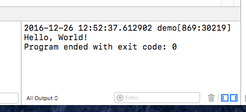

---
title: "Objective-C 编程"
---

本节将直接切入主题, 演示如何编写第一个Objective-C程序.

&emsp;&emsp;首先, 举一个很简单的例子, 在屏幕上显示短语 "programming is fun!" 的程序.以下代码显示了完成此任务的代码.  
	#import <Foundation/Foundation.h>  
	int main (int argc, const char *argv[])&nbsp;&nbsp;{  
	&emsp;&emsp;@autoreleasepool&nbsp;&nbsp;{  
		&emsp;&emsp;&emsp;&emsp;NLog (@"Programming is fun!");  
	&emsp;&emsp;}  
}


## 编译并运行程序

&emsp;&emsp;在详细解释这个程序之前, 我们首先要学习编译和运行此程序的步骤. 可以使用Xcode编译并运行程序, 也可以使用GUN Objective-C编译器在Terminal窗口编译并运行程序. 我们将用这两种方法分别实现这一系列步骤. 然后, 你可以确定如何处理本教程其余部分的程序.

	
***

### 使用Xcode
&emsp;&emsp;Xcode是一款功能齐全的应用程序, 使用它可轻松输入, 编译, 调试和执行程序. 

启动Xcode, 在启动页面选择 "Create a new Xcode projects"
  
此时出现一个窗口, 如下图所示.
  
在macOS下, 选择command Line Tool后, 会弹出一个面板.
  
输入应用的名字, 及Organization Identifier, 点击Next. 选择创建位置, 点击Create按钮创建新应用. 显示如下.
  
在左侧窗格选择main.m, 现在, 你可以输入第一个程序了.
  
Objective-C源文件使用.m作为文件名的最后两个字符(称为扩展名). 如下列出了常见的文件扩展名:

.c C语言源文件  
.cc, .cpp C++语言源文件  
.h 头文件  
.m Objective-C源文件  
.mm Objective-C++源文件  
.pl Perl源文件  
.o Object(编译后的)文件

返回Xcode项目窗口, 窗口右侧显示了文件main.m的内容, Xcode能自动创建一个模板文件,包含以下内容:

//  
//  main.m  
//  demo  
//  
//  Created by 张冬冬 on 2016/xx/xx.  
//  
//  

	#import <Foundation/Foundation.h>
	int main (int argc, const char *argv[])&nbsp;&nbsp;{
	&emsp;&emsp;@autoreleasepool&nbsp;&nbsp;{
	&emsp;&emsp;&emsp;&emsp;NLog (@"Programming is fun!");
	&emsp;&emsp;}
	}

&emsp;&emsp;你可以在该窗口编辑文件. 修改Edit窗口中显示的程序, 使之与本节开始时给出的程序相符. 以两个斜杠字符//开始的行称为注释.

&emsp;&emsp;现在可以用Xcode编译并运行第一个程序了, 在这之前, 通过点击右上角中间图标
  
可以打开一个窗口, 该窗口用于显示程序的运行结果(输出). 将鼠标置于图标之上会显示 "Hide or show the Debug area". 在有数据写入调试区域时, Xcode一般会自动显示调试区域.

&emsp;&emsp;现在, 单击上方Run按钮, 或者command+r, Xcode将会分别执行编译和运行程序. 当你的程序没有错, 运行的过程才会执行.

&emsp;&emsp;如果在你的程序中出现错误, 会出现红色感叹号表示的错误, 只有修正了这些错误, 才能运行程序. 如果出现黄色感叹号表示的警告, 在消除这些警告之前, 尽管你仍能运行程序, 但通常需要检查并修正这些问题. 修正所有的错误, 运行程序之后, 右下区域会显示程序的输出.如下所示.  


***

### 使用Terminal
&emsp;&emsp;如果习惯于使用UNIX shell和命令行工具, 可能会用Terminal应用来编辑, 编译和运行程序. 下面说明如何使用Terminal执行上述操作.

&emsp;&emsp;启动Mac机器上的Terminal应用程序. 启动之后将会看到类似如下窗口.
  
在每一行的$之后输入命令. 如果读者熟悉UNIX的使用, 这是很容易理解的.

&emsp;&emsp;首先需要将本节开头给出的代码输入到一个文件中. 开始可以创建一个用于存放该程序例子的目录. 然后还必须运行一个文本编辑器来输入这个程序:
  
&emsp;&emsp;对于Objective-C文件, 可以选择使用任何名字, 只要确保最后两个字符是.m即可. 这样编译器就知道有一个Objective-C程序.  
&emsp;&emsp;将程序输入到文件后, 可以使用名为clang的LLVM Clang Objective-C编译器来编译并链接这个程序.

clang命令的一般格式为:
clang -fobjec-arc -framework Foundation files -o progname

&emsp;&emsp;该选项说明要使用有关Foundation框架的信息:
-framework Foundation  
&emsp;&emsp;files表示要编译的文件列表, 在我们的例子中, 这样的文件只有一个, 我们将其命名为main.m. 如果编译时没有任何错误, 
那么包含这个可执行文件的文件名将是progname.  
示例如下:  


&emsp;&emsp;命令提示符在返回时没有附带任何消息, 这意味着编译器没有在程序中发现错误. 现在可以在提示符后输入名称来执行这个程序.
很可能出现命令未找到的错误信息. 导致这种情况的原因是:UNIX shell并不知道该可执行文件位于何处, 此时有两种解决方法:
 1. 将字符./放在程序名之前,以便告知shell在当前目录查找要执行的程序.
 2. 将用于存放程序的目录添加到shell的PATH变量.  
我们采用第一种方法.  


***

## 解释第一个程序
&emsp;&emsp;在Objective-C中, 小写字母和大写字母是有区别的. 同样, Objective-C并不关心你在程序的何处开始输入 -- 程序行的任何位置都能输入语句.  
&emsp;&emsp;程序的第一行引入了注释的概念. 程序中使用注释语句为程序提供说明, 并增强程序的可读性.  
向程序添加注释有两种方法.
 1. 使用两个连续的斜杠.双斜杠后直到这行结尾的任何字符都将被编译器会略.
 2. 注释还能以/和\* 两个字符开头, 表示注释的开始. 要终止注释, 需要再次使用 \*/字符, 而且中间不能插入任何空格. 开始/\*和技术\*/之间的所有字符都被看做是注释语句的一部分, 从而被编译器忽略.  	
&emsp;&emsp;使用哪种风格的注释完全由你决定. 只要注意, /*风格的注释不能嵌套使用即可.  
&emsp;&emsp;#import <Foundation/Foundation.h>
这是一个文件系统, #import表示将该文件的信息导入或包含到程序中.  
&emsp;&emsp;程序行int main(int argc, const char *argv[])指定程序的名称为main, 他是一个特殊的名称, 用于准确的表示程序将在何处开始执行.  
&emsp;&emsp;main之前的保留字int指定main的返回值类型, 暂时忽略括号里的内容, 他们与命令行参数的内容有关, 在之后讨论.  
&emsp;&emsp;main中的下一行语句为@autoreleasepool {}, 花括号之间的程序语句会在被称为自动释放池的语境中执行. 自动释放池的机制是:
它使应用在创建对象时,系统能够有效的管理应用所使用的内存. 相关内容将在之后详细介绍.  
&emsp;&emsp;下一条语句指定调用名为NSLog的函数, 传递给NSLog函数的参数是以下字符串: @"Programming is fun!". 此处@符号在位于一对双引号中的字符串之前, 称为常量NSString对象.  
&emsp;&emsp;注意, Objective-C的所有程序语句必须使用 ; 结束.

	

